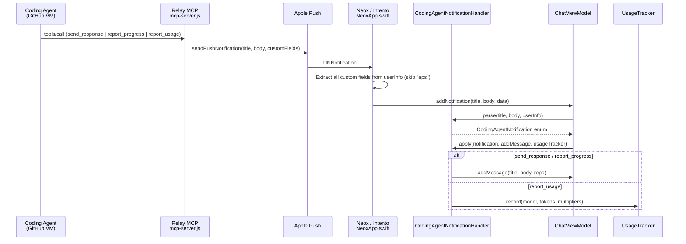

# Coding Agent Notification Schema

Defines the contract between relay MCP tools, APNs payloads, and on-device parsing in `CodingAgentNotificationHandler`.

## Data Flow



## APNs Payload Structure

All coding agent notifications share a common envelope:

```json
{
  "aps": {
    "alert": { "title": "...", "body": "..." }
  },
  "type": "coding_agent",
  "action": "<action_name>",
  "repo": "neos-apps/project-name"
}
```

Additional fields vary by action:

### send_response

Message from coding agent to user. Displayed in chat.

| Field | Type | Source |
|-------|------|--------|
| `type` | `"coding_agent"` | always |
| `action` | `"send_response"` | always |
| `repo` | String | project repoName |

Message content is in APNs alert title/body. No extra fields.

### report_progress

Milestone update: build started, tests passing, PR ready.

| Field | Type | Source |
|-------|------|--------|
| `type` | `"coding_agent"` | always |
| `action` | `"report_progress"` | always |
| `repo` | String | project repoName |
| `status` | `"info"` \| `"success"` \| `"warning"` \| `"error"` | agent chooses |

Status maps to emoji: info→ℹ️, success→✅, warning→⚠️, error→❌.

### report_usage

Token usage for on-device cost tracking. Not shown in chat.

| Field | Type | Source |
|-------|------|--------|
| `type` | `"coding_agent"` | always |
| `action` | `"report_usage"` | always |
| `repo` | String | project repoName |
| `model` | String | e.g. `"gpt-4.1"`, `"claude-sonnet-4-20250514"` |
| `promptTokens` | Int | input tokens used |
| `completionTokens` | Int | output tokens used |
| `totalTokens` | Int | prompt + completion |

## On-Device Processing

### CodingAgentNotificationHandler (copilot-ios/CopilotChat)

**Location:** `CopilotChat/Sources/Services/CodingAgentNotificationHandler.swift`

Shared across all apps using copilot-ios. Two-step API:

1. **parse(title, body, userInfo)** → `CodingAgentNotification?`
   - Returns `nil` if `type != "coding_agent"` (falls through to legacy handling)
   - Returns typed enum: `.message`, `.progress`, or `.usage`

2. **apply(notification, addMessage, usageTracker)**
   - `.message` / `.progress` → calls `addMessage` to insert into chat
   - `.usage` → calls `UsageTracker.record()` with model multipliers from `CostCalculator`

### App Delegate (NeoxApp.swift)

Forwards ALL custom APNs fields (everything except `aps` key) as the `data` dictionary. Does not hardcode field names — future actions work automatically.

```swift
var data: [String: Any] = [:]
for (key, value) in content.userInfo {
    if let k = key as? String, k != "aps" {
        data[k] = value
    }
}
```

### UsageTracker (copilot-ios/CopilotSDK)

Records token usage with per-model cost multipliers. Persists balance to UserDefaults. `CostCalculator.fallbackMultipliers(for:)` provides input/output multipliers per model.

## Adding a New Action

1. **Relay:** Add tool to `MCP_TOOLS` in `mcp-server.js`, add handler function
2. **APNs:** Include `type: "coding_agent"` and `action: "<name>"` in custom fields
3. **Handler:** Add case to `CodingAgentNotification` enum and both `parse()` / `apply()`
4. **No app changes needed** — NeoxApp.swift already forwards all custom fields
