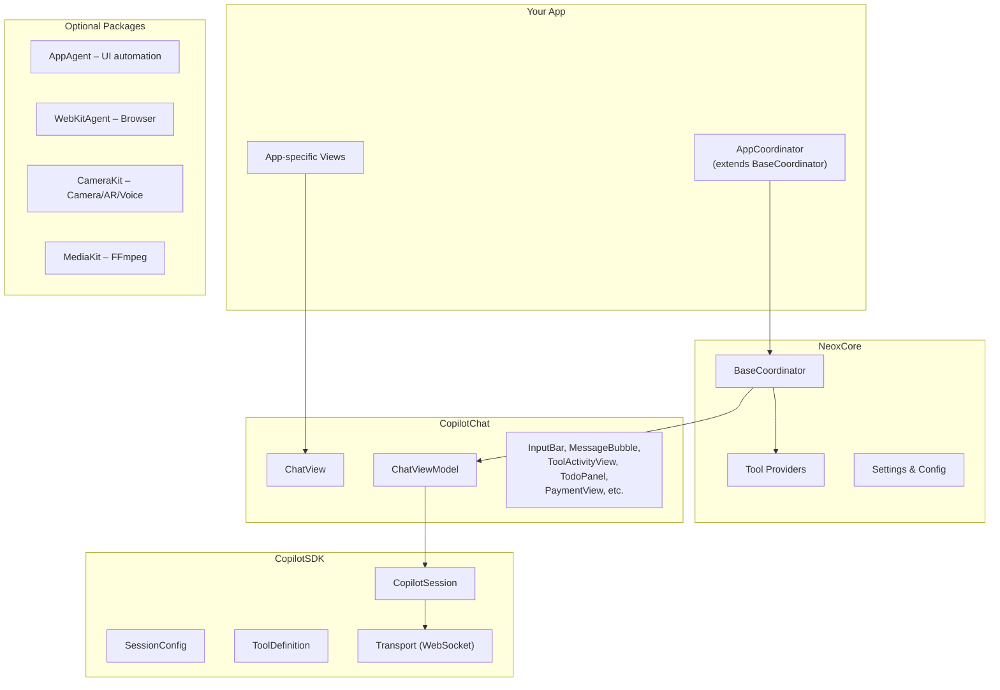

# copilot-ios Shared Components

When building an AI-powered iOS app, use these shared packages. Do NOT reimplement chat, tools, or coordinators from scratch.

## Architecture



## Required: BaseCoordinator

Every AI app creates a coordinator subclass:

```swift
class MyAppCoordinator: BaseCoordinator {
    override var appId: String { "my-app" }
    
    override var iapPacks: [PaymentManager.CreditPack] { 
        // your IAP products
    }
    
    override func additionalTools() -> [ToolDefinition] {
        // app-specific tools
    }
}
```

BaseCoordinator provides automatically:
- Relay connection management
- All standard tool providers (file, memory, terminal, script, download, sub-agent)
- ChatViewModel lifecycle (`createChatViewModel()`)
- Usage tracking and payment
- Agent profile loading from `.github/agents/`
- Workspace bootstrapping

## Required: ChatView

Use the shared `CopilotChat.ChatView` for all chat interfaces:

```swift
if let chatVM = coordinator.chatViewModel {
    CopilotChat.ChatView(viewModel: chatVM, inputModes: coordinator.chatInputModes)
}
```

ChatView includes: message bubbles, tool activity display, todo panel, ask_questions UI, markdown rendering, attachment handling, payment integration.

## Required: Agent Files

Place agent definitions in workspace `.github/agents/`:
- `main.agent.md` – Orchestrator (loaded automatically by BaseCoordinator)
- `{name}.agent.md` – Sub-agents (discovered by SubAgentToolProvider)

## Package Reference

| Package | What It Provides | When to Use |
|---------|-----------------|-------------|
| **CopilotSDK** | Session, tools, transport, config | Always (core protocol) |
| **CopilotChat** | ChatView, ChatViewModel, UI components | Always (chat UI) |
| **NeoxCore** | BaseCoordinator, tool providers, settings | Always (app infrastructure) |
| **AppAgent** | Native iOS UI automation (tap, type, swipe) | Testing, demos, automation |
| **WebKitAgent** | Browser automation, site adapters | Web scraping, platform integration |
| **CameraKit** | Camera control, AR, voice I/O | Video/photo capture apps |
| **MediaKit** | FFmpeg video/audio processing | Media editing apps |

## Override Points

| Override | Default | Purpose |
|----------|---------|---------|
| `appId` | "neox-core" | Relay workspace routing |
| `iapPacks` | [] | Apple IAP credit packs |
| `stripePaymentURL` | nil | Stripe payment link |
| `additionalTools()` | [] | App-specific tools |
| `configureChat(vm:)` | no-op | Post-creation chat setup |

## Anti-Patterns

- Creating a custom chat view instead of using `CopilotChat.ChatView`
- Implementing session management directly instead of through `BaseCoordinator`
- Duplicating tool providers that already exist in NeoxCore
- Hardcoding relay connection instead of using coordinator settings
