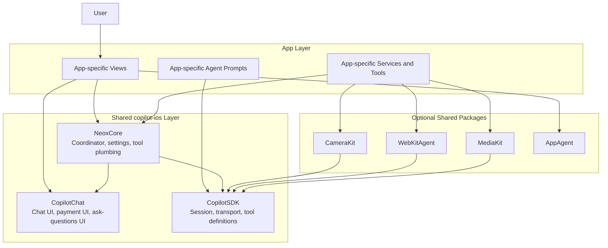

# copilot-ios Shared Components

This document explains what an AI app should reuse from the shared copilot-ios packages, what should stay app-specific, and what should move into shared infrastructure next.

## Goal

The goal is not to make every app look identical.

The goal is to make every AI app reuse the same foundation for:
- chat
- agent session setup
- payments and credits
- relay and device settings
- common tool plumbing

App-specific code should focus on domain behavior: recruiting, content creation, messaging, filming, browsing, or other product logic.

## Shared Boundary

## What Must Be Shared

### CopilotChat

Use shared chat UI instead of creating custom chat surfaces.

CopilotChat is the common layer for:
- chat view and message rendering
- tool activity display
- ask-questions interaction
- markdown display
- payment sheet UI
- common chat affordances

If two apps need the same chat behavior or chat-adjacent UI, it belongs here.

### NeoxCore

Use BaseCoordinator as the common app runtime layer.

NeoxCore is the common layer for:
- relay configuration and reconnect behavior
- workspace bootstrap
- shared tool providers
- chat session construction
- usage tracking and payment manager wiring
- common settings state

If a behavior is about how an AI app boots, connects, configures, or assembles tools, it belongs here.

### Optional Shared Packages

Use CameraKit, WebKitAgent, MediaKit, and AppAgent when the app needs those capabilities.

These stay reusable because they solve capability problems, not product problems.

## What Should Stay App-Specific

Keep these in the app target:
- product-specific views and flows
- domain services and domain models
- domain tool providers
- app-specific channel integrations
- app-specific agent prompts and sub-agent prompts

Examples:
- HireFlow recruiting tools are app-specific
- Intento filming and editing flows are app-specific
- Neox messaging and channel logic are app-specific

## Current Reuse Model

Today, the shared model is strongest in chat and coordinator infrastructure, but weaker in three places:
- settings UI
- runtime app configuration
- tool assembly customization

Those are the next shared extractions.

## AI App Operating Modes

Shared infrastructure should support two operating modes.

### 1. User Control Mode

This is the first mode every app should implement.

In this mode:
- the user drives the workflow step by step
- the app exposes explicit actions for the next available step
- the app may create or recover an orchestrator session for the current step
- the orchestrator can still call sub-agents, but only in service of the user-triggered step
- the user can pause, resume, or branch at any time

This mode is more controllable and easier to test because product state stays visible in the app UI.

### 2. Orchestrator Chat Mode

This is the second mode, added after user control mode is solid.

In this mode:
- the user talks directly to the orchestrator in chat
- the orchestrator drives the workflow end to end
- the orchestrator uses the shared tools and sub-agents needed to produce the final result
- the app behaves like a 5-layer AI app with the orchestrator coordinating the full pipeline

This mode should reuse the same domain services, toolkits, and state transitions proven in user control mode.

## Delivery Order

The correct implementation order is:
1. Build shared infrastructure that supports user control mode.
2. Migrate apps to the shared step-driven flow first.
3. Register the orchestrator tools and orchestration surface for full chat-driven control after the step flow is stable.

User control mode is the proving ground. Orchestrator chat mode should sit on top of it, not replace it as the first implementation.

## Next Shared Extractions

### 1. Shared Settings Sections

All AI apps should share the same common settings sections:
- Top Up
- About
- Developer

The shared layer should provide a common settings shell and common section views.

Apps should only inject their own product-specific sections around that shell. For example:
- HireFlow can add recruiting or demo-data settings
- Intento can add filming or browser settings
- Neox can add channel-specific settings

The point is that common settings should stop being rewritten in each app.

### 2. Plist-Driven Runtime App Config

Common app identity and commerce configuration should come from Info.plist rather than hard-coded coordinator overrides.

This shared config should cover:
- app identifier used for relay sessions
- Stripe payment URLs
- Stripe verify URLs when needed
- Apple IAP pack metadata
- shared About metadata when appropriate

That keeps BaseCoordinator generic and makes app setup declarative instead of scattering configuration through subclasses.

### 3. Toolkit-Based Tool Assembly

BaseCoordinator currently owns the shared tool pipeline, but subclasses still need a cleaner way to exclude or reshape it.

The shared layer should treat tools as named shared toolkits.

That lets an app:
- use the standard shared toolkits by default
- exclude one toolkit or one shared tool cleanly
- add app-specific tools on top

The goal is to avoid subclass reimplementation of shared tool assembly logic.

## Decision Rule

When deciding whether something belongs in shared code, use this test:

- If it is needed by multiple AI apps and does not depend on product-specific domain logic, move it into shared code.
- If it expresses product identity, domain workflow, or product-specific tool behavior, keep it in the app.

## Migration Strategy

The safest rollout is:
1. Build the shared NeoxCore pieces first.
2. Migrate Intento first to validate the API on a simpler app.
3. Migrate HireFlow next.
4. Migrate Neox last because it has the broadest settings surface and channel-specific behavior.

## Anti-Patterns

Avoid these:
- creating a custom chat view when shared chat already covers the behavior
- hard-coding app identity and commerce config in coordinators when it can be declarative
- copying common settings sections into each app
- rebuilding the shared tool list in subclasses instead of extending or trimming it
- moving product-specific domain logic into shared packages just because more than one screen touches it

## Practical Intent

The shared layer should make a new AI app feel like assembly, not reinvention.

An app should plug in:
- its product logic
- its domain tools
- its agent prompts

And inherit the rest from shared packages.