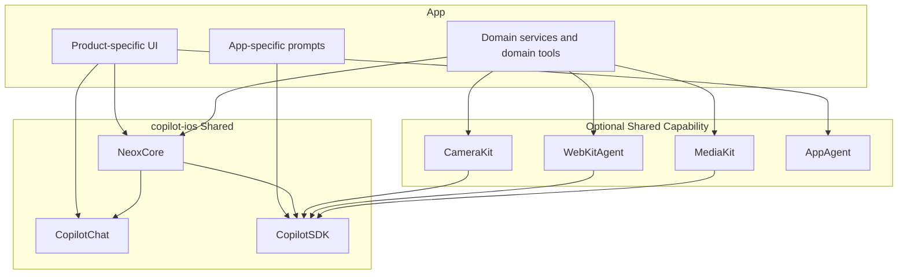

# Shared Neox Migration Design

## Goal

Move common AI app infrastructure into shared copilot-ios packages so new and existing apps stop reimplementing chat-adjacent UI, runtime configuration, and shared tool assembly.

## Product Rule

Every AI app should support two operating modes:
- User control mode first
- Orchestrator chat mode second

User control mode is the primary delivery path because it keeps workflow state explicit in the UI and easier to test. Orchestrator chat mode should reuse the same proven state transitions, services, and toolkits rather than inventing a parallel workflow.

## Shared Boundary

## Shared Extractions

### Shared settings

NeoxCore should provide the common settings shell and the shared sections used across AI apps:
- Top Up
- About
- Developer

Apps should only add domain-specific sections before or after these common sections.

### Plist-driven app runtime config

BaseCoordinator should default to reading app identity and commerce metadata from Info.plist:
- appId
- Stripe payment URL
- Stripe verify URL
- IAP pack metadata
- optional About metadata

This keeps runtime configuration declarative and prevents repeated hard-coded coordinator overrides.

### Toolkit-based tool assembly

BaseCoordinator should assemble shared tools from named toolkits. Apps should be able to:
- use the default shared toolkits
- exclude one toolkit
- exclude one specific shared tool
- add app-specific tools

This keeps shared tool assembly in one place while preserving app flexibility.

## Operating Modes

### User control mode

The user triggers the next workflow step from the app UI. The app may create or recover an orchestrator session for that step, but the user remains in control of progression, pause, resume, and branching.

### Orchestrator chat mode

The user talks directly to the orchestrator. The orchestrator drives the workflow using the same toolkits, services, and state transitions proven in user control mode.

## Migration Order

1. Add shared NeoxCore and CopilotChat foundations.
2. Refactor Intento as the first adopter.
3. Migrate HireFlow and Neox onto the shared settings, config, and toolkit model.
4. Add or expand orchestrator chat mode on top of the proven user-control path.

## Testing Strategy

- Verify shared settings render correctly in each migrated app.
- Verify plist-driven app config resolves the correct app identity and commerce metadata.
- Verify toolkit exclusions do not leak removed tools into chat sessions.
- Verify Intento still supports its approved orchestrator and filming flows after migration.
- Verify apps continue to boot and reconnect correctly after coordinator refactors.

## Risks

- Over-generalizing settings before the real common surface is stable
- Breaking app-specific coordinator behavior while centralizing config
- Mixing orchestrator chat behavior into user control mode too early

## Decision

Proceed with shared infrastructure first, migrate Intento first, and treat user control mode as the required base layer for future orchestrator chat behavior.
