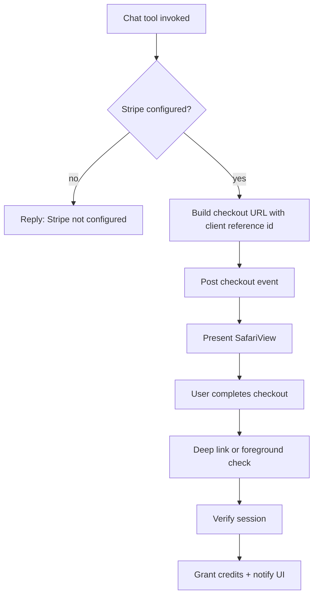

# Stripe Checkout via Chat Tool (SafariView)

## Overview
Make Stripe top-ups available only through the coordinator chat tool and present checkout in an in-app SafariView. Settings should no longer expose a Stripe button. App Store IAP remains in Settings if configured.

## Goals
- Stripe checkout is triggered only from the coordinator chat tool.
- Checkout opens in SafariView (SFSafariViewController) for a simple, consistent in-app flow.
- Stripe links are sourced from runtime config, not hardcoded defaults.
- Credits are verified and granted when verification is available; otherwise credits rely on server sync.

## Non-Goals
- Changing Apple IAP flows.
- Introducing a full in-app WebKit browser for checkout.
- Redesigning Settings beyond removing the Stripe button.

## User Flow
- User asks for credits or agent decides balance is low.
- Coordinator chat tool triggers Stripe checkout.
- SafariView opens with the Stripe checkout URL.
- On completion, the app verifies the Stripe session and grants credits.

## Components & Responsibilities
- SharedTopUpSettingsSection: remove Stripe button; optionally show a short note that Stripe is available in chat when configured.
- BaseCoordinator: sync runtime-config Stripe URL into the UserDefaults key used by the chat tool.
- Chat tool: builds the checkout URL and posts the checkout event for UI presentation.
- App UI: listens for checkout events and presents SafariView.
- Stripe verification: use deep-link and foreground checks to verify and grant credits when available.

## Event & Config Contracts
- UserDefaults key: stripePaymentLink, set from runtime config stripePaymentURL on startup and reconnect.
- Clear stripePaymentLink when runtime config has no Stripe URL to avoid stale links.
- UserDefaults key: pendingStripeCheckoutRef, set to the client reference id used in checkout for idempotent verification.
- stripeVerifyURL source: AIAppRuntimeConfig (NeoxAppConfig). BaseCoordinator exposes it for apps that support verification.
- Notification: stripeCheckoutRequested
    - Payload: checkout URL (Notification.object)
    - Optional userInfo: client_reference_id (String)
    - Producer: chat tool
    - Consumers: app root views that present SafariView
    - In-progress state: ChatViewModel.stripeCheckoutURL is non-nil
    - Presentation should be attached to the active scene's root view to avoid presenting from a background scene

## Stripe Config Criteria
- Stripe is considered configured when stripePaymentLink is non-empty and has a valid https URL.
- Verification is available when stripeVerifyURL is present or when the app provides a relay-host verification endpoint (Neox).

## Checkout URL Format
- stripePaymentLink is the base Stripe payment link URL (no client_reference_id query param).
- The chat tool appends client_reference_id and optional amount_usd when building the final URL.
- If stripePaymentLink includes a {CLIENT_ID} token, replace the token with the generated client reference id and do not append client_reference_id.
- If stripePaymentLink already contains a client_reference_id query param, use it as-is and set pendingStripeCheckoutRef from that value.
- amount_usd is only included when the tool args provide a positive value; otherwise omit it.
- amount_usd format: decimal dollars with 2 fractional digits (e.g., 7.50), rounded to 2 decimals.
- Query parameter values must be URL-encoded.
- If amount_usd already exists in the base URL, do not override it.
- If client_reference_id already exists in the base URL, amount_usd may still be appended if not present.
- Stripe Payment Link success/cancel URLs should be configured in the Stripe dashboard to redirect to the app scheme when deep-link verification is desired.

## Client Reference ID
- Source: identifierForVendor when available; otherwise a generated UUID stored in UserDefaults and reused.
- Persisted in pendingStripeCheckoutRef for retries and idempotency.

## Verification Contract
- Deep-link (when supported): app-scheme://stripe/success?session_id=...
    - Neox: neox://stripe/success
    - HireFlow: hireflow://stripe/success (only if Stripe is configured later)
    - Intento: no scheme today; use foreground verification until a scheme is added
- Foreground check: use client reference id (pendingStripeCheckoutRef) to verify when deep-link is not available.
- Verify endpoint: Neox always uses http://{relayHost}:{relayPort + 1}/stripe/verify. Other apps use stripeVerifyURL when provided.
- Verify request fields:
    - Deep-link success: session_id
    - Foreground check: client_reference_id
- Expected response fields: ok, sessionId, productId, duplicate (Boolean) for idempotency.
- Foreground verification trigger: app becomes active.
- On successful verification, dismiss SafariView if still presented.

## Data Flow

## Error Handling
- If Stripe is not configured, the tool returns a clear message.
- If SafariView is dismissed, do not reopen automatically; verification still runs on next foreground.
- Keep the existing fallback to external Safari if SafariView fails to present.
- If verification fails due to network or relay error, keep pendingStripeCheckoutRef and retry on next foreground.
- If verification reports duplicate, do not re-grant credits.
- If a checkout event arrives while SafariView is already shown, ignore the new event and return a message that checkout is already in progress.
- If the relay returns a productId that is not mapped to credits, do not grant credits and log the mismatch.
- If a deep-link cancel URL is configured and received, clear pendingStripeCheckoutRef and do not verify.

## pendingStripeCheckoutRef Lifecycle
- Set when generating a checkout URL.
- If a checkout is already in progress (SafariView presented), do not overwrite; return "checkout already in progress."
- If SafariView is not presented and a new checkout is requested, overwrite pendingStripeCheckoutRef with the new id.
- Clear on successful verification or duplicate response.
- Keep on SafariView dismissal; verification still runs on next foreground.

## Testing Plan
- Confirm Settings has no Stripe button and IAP remains visible.
- Invoke the chat tool and verify SafariView opens with the correct URL.
- Validate the Stripe URL source matches runtime config.
- Complete a test checkout and confirm credits are granted.
- Negative cases: Stripe not configured, user dismisses SafariView, verification failure, duplicate verification response.
- URL composition edge cases: existing query params, {CLIENT_ID} replacement, existing client_reference_id, existing amount_usd, amount_usd rounding.

## Rollout Notes
- Apply to apps with Stripe configured (Intento, Neox). HireFlow remains unchanged until Stripe is configured.
